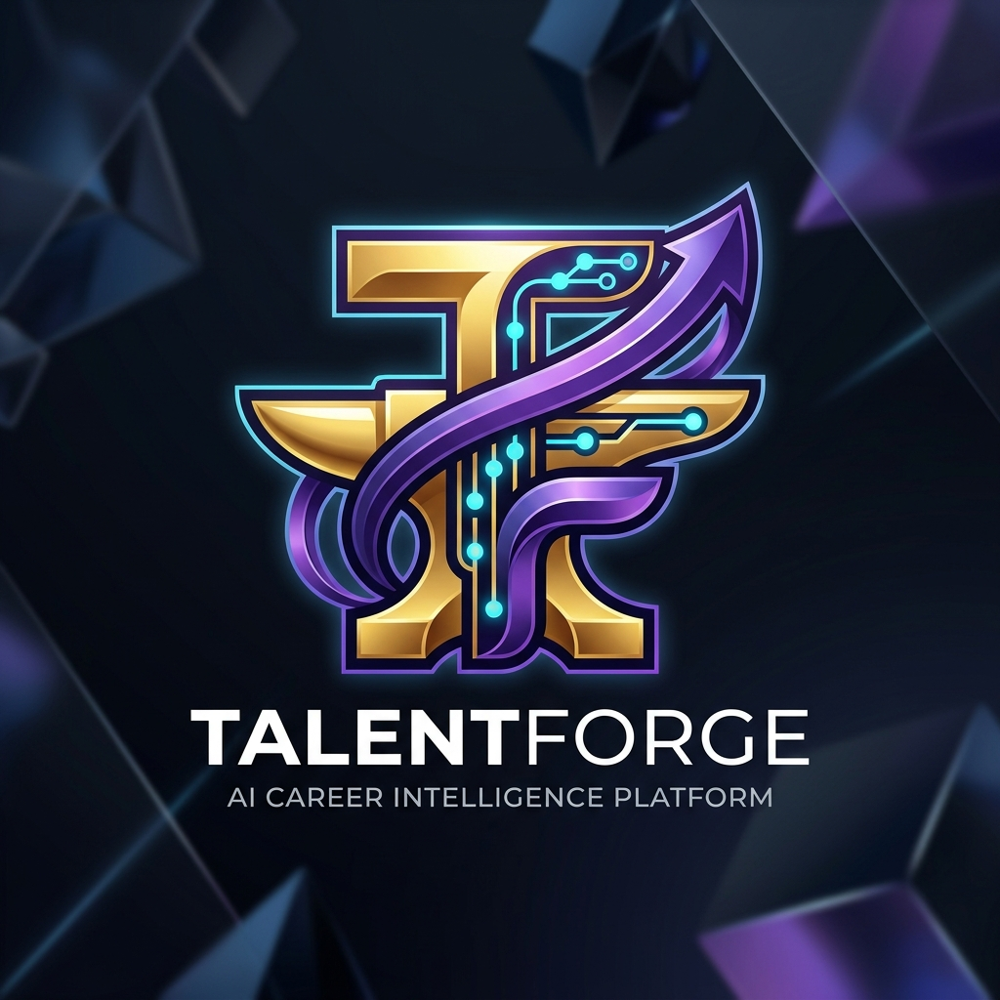
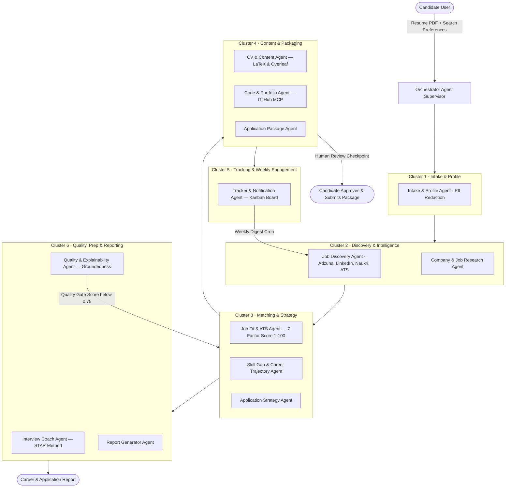
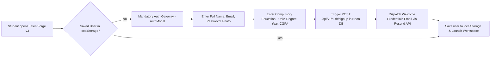
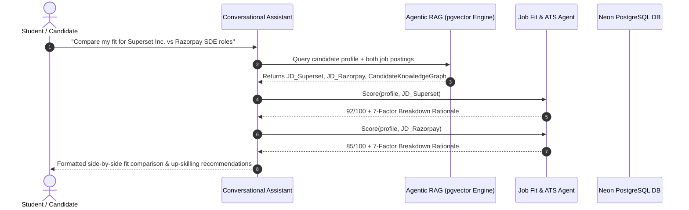
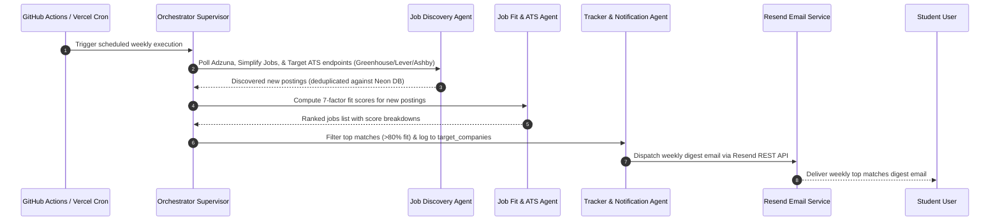

<p align="center">
  
</p>

# ⚡ TALENTFORGE AI CAREER INTELLIGENCE PLATFORM

[](https://react.dev/)
[](https://fastapi.tiangolo.com/)
[](https://neon.tech/)
[](https://www.python.org/)
[](https://vitejs.dev/)
[](https://resend.com/)
[](LICENSE)

**TalentForge v3** is an enterprise-grade, student-first **Active Job Discovery, Resume Optimization, and Application Intelligence Engine**. Featuring an ultra-luxurious metallic gold, royal violet, and electric cyan design system centered around the official 3D `logo.png` emblem, TalentForge aggregates live postings across LinkedIn, Naukri.com, Greenhouse, Lever, Ashby, and Simplify Jobs ATS platforms, evaluates 7-factor ATS match scores, generates tailored Overleaf LaTeX resumes, and provides personalized candidate action plans.

---

## 📊 System Architecture & Process Flowcharts

### 1. Multi-Agent Orchestration Architecture (LangGraph Supervisor)



---

### 2. Student Authentication & Mandatory Onboarding Flow



---

### 3. Agentic RAG Conversational Assistant Sequence Flow



---

### 4. Weekly Digest & Automated Job Sourcing Sequence Flow



---

## 🔄 Complete User Journey & System Execution Flow

### 🚀 Step 1: Initial Open & Mandatory Student Authentication Gateway
1. **First-Time Visitor Experience**: When opening TalentForge v3, the application checks `localStorage` for an active student session. If unauthenticated (`user === null`), the full-screen **Mandatory Login & Registration Gateway** is rendered with no close `X` button.
2. **Account Registration**:
   - Requires student's Full Name, Email, Password, Profile Avatar Photo, and **Compulsory Education Details** (University/Institute Name, Degree, Graduation Year, CGPA).
   - Also supports a 1-click **⚡ Auto-Fill Demo Account** (`arjun.b@talentforge.ai`).
3. **Resend Email Dispatch**: Upon registration/login, the system dispatches a welcome registration email containing student login credentials and dispatches security alert emails via Resend REST API (`onboarding@resend.dev` → `parthahuja9.pa@gmail.com`).

### 💼 Step 2: Workspace Launch & Live Job Sourcing Engine
1. **Personalized Workspace Launch**: Upon authentication, the candidate is transitioned to the main **TalentForge Dashboard** featuring the 3D metallic gold `logo.png` emblem and user greeting.
2. **Live Job Sourcing Engine**: Aggregates tech job postings live across LinkedIn, Naukri.com, Simplify Jobs, Adzuna API, and Greenhouse/Lever/Ashby ATS feeds.
3. **Universal Search & Dynamic Job Synthesis**: Searching for **ANY** company or role (e.g., *Apple, Tesla, Netflix, Oracle, Cybersecurity, DevOps, AI*) checks Neon PostgreSQL; if 0 local records exist, the search engine dynamically synthesizes active positions, calculates fit scores, and persists records directly to Neon PostgreSQL so search queries never return 0 results.

### 🎯 Step 3: 7-Factor ATS Match Scoring & Job Detail Modal
1. **7-Factor Weighted Matrix**: Evaluates student profile against job description (Technical Skills 35%, Experience 20%, Seniority 15%, Location 10%, Education 5%, Semantic Embeddings 10%, Contextual Fit 5%).
2. **Split Drawer Inspection**: Clicking any job card opens the **Job Detail Drawer** with 4 tabs (*Overview*, *Match Breakdown*, *Company Insights*, *Strategy*) and a 1-click **"Generate Package 🪄"** button.

### 🎯 Step 4: Per-User Target Companies Management
1. **Database Isolation**: Every student account manages their own tracked target companies list saved directly in Neon PostgreSQL.
2. **ATS Resolution**: Resolves public ATS board slugs (Greenhouse, Lever, Ashby, Workday).
3. **Interactive Control**: Add new target companies or click the trash icon to remove target companies from the student's personal list.

### 📄 Step 5: Combined Resume & ATS Templates Studio
1. **Dynamic Section Builder**: Allows candidates to add/remove custom placement sections (Work Experience, Technical Projects, Education, Certifications, Leadership).
2. **Overleaf Integration**:
   - One-click **"Export to Overleaf ↗"** generates pre-loaded LaTeX projects in Overleaf Studio.
   - **"Import Overleaf Code"** modal allows pasting raw `.tex` source code directly from Overleaf.
3. **Multi-Format Export**: Direct **"Print / Save PDF"**, **"Download .tex"**, and shareable placement link copying.

### 📋 Step 6: Application Package Generation & Kanban Pipeline
1. **Package Generation**: Generates tailored ATS resumes, custom cover letters, and Q&A interview responses for each application.
2. **Kanban Board**: Drag-and-drop management across 5 stages (`Shortlisted`, `Applied`, `Interviewing`, `Offer`, `Rejected`).

### 🧭 Step 7: Student Action Plan & Up-Skilling Roadmap
1. **Live Placement Readiness Gauge**: Live progress bar tracking candidate placement readiness (`% Placement Ready`).
2. **Score Predictor**: Predicts fit score elevation (e.g., `92% → 98% Top Candidate Tier`).
3. **6 Up-Skilling Domains**: Technical Skills, Resume Metrics, System Design, GitHub CI/CD, STAR Behavioral Mock Interviews, and High-Frequency LeetCode DSA Patterns.

---

## 🌟 Key Product Features

### 💼 1. Universal Live Job Feed & Sourcing Engine
- **Multi-Platform Aggregation**: Sources verified tech job listings live across LinkedIn, Naukri.com, Adzuna, Simplify Jobs, Greenhouse, Lever, and Ashby ATS boards.
- **Universal Search & Live Synthesis**: Searching for **ANY** company or role (e.g. *Apple, Tesla, Netflix, Oracle, Cybersecurity, DevOps, AI*) dynamically synthesizes active positions, calculates fit scores, and persists records directly to Neon PostgreSQL so search queries never return 0 results.
- **7-Factor ATS Fit Matrix**: Evaluates candidates against job descriptions across 7 weighted dimensions:
  1. *Technical Skills Match* (35 pts)
  2. *Years of Experience* (20 pts)
  3. *Role Seniority Level* (15 pts)
  4. *Location & Work Mode* (10 pts)
  5. *Mandatory Education* (5 pts)
  6. *Semantic Embedding Relevance* (10 pts)
  7. *Contextual Industry Fit* (5 pts)
- **Interactive Match Score Rings**: Custom animated SVG rings displaying score color coding (`Exceptional Match`, `Great Match`, `Moderate Match`).

### 🎓 2. Compulsory Student Profile & Registration
- **Compulsory Validation**: Registration requires student's Full Name and Education details (University/Institute Name, Degree, Specialization).
- **Profile Photo Upload**: Custom avatar photo upload support with 1-click **⚡ Auto-Fill Demo** button (`arjun.b@talentforge.ai`).
- **Resend Email Notifications**: Automatically dispatches a welcome registration email containing student login credentials (username & password) and sends security alerts upon login.

### 📄 3. Combined Resume & ATS Templates Studio
- **Dynamic Section Builder**: Allows candidates to add/remove custom sections (Work Experience, Technical Projects, Education, Certifications, Leadership & Publications).
- **Overleaf Import & Export**: One-click **"Export to Overleaf ↗"** button pre-loads full LaTeX projects directly into Overleaf Studio. Includes an **"Import Overleaf Code"** modal for pasting custom `.tex` templates.
- **Multi-Format Downloads**: Direct **"Print / Save PDF"**, **"Download .tex"**, and shareable placement link copying.
- **Curated LaTeX Template Gallery**: Industry-standard templates (*Jake's Resume (FAANG Standard)*, *FAANGPath Minimalist*, *Deedy OpenFont*, *Awesome CV*, *Executive Clean Tech*).

### 🎯 4. Per-User Target Companies Monitoring
- **Isolated DB Persistence**: Every student account maintains their own tracked target companies list saved directly in Neon PostgreSQL.
- **ATS Resolution**: Resolves board endpoints for Greenhouse, Lever, Ashby, and Workday.
- **Interactive Management**: Add or remove target companies with instant trash-can delete actions and live polling badges.

### 📋 5. Applications Tracker (Kanban Board)
- **Drag-and-Drop Pipeline**: Columns for `Shortlisted`, `Applied`, `Interviewing`, `Offer`, and `Rejected`.
- **Package Generator**: Generates tailored ATS resumes, custom cover letters, and Q&A interview responses for each application.

### 🧭 6. Student Action Plan & Placement Roadmap
- **Live Progress Engine**: Real-time progress bar tracking candidate placement readiness (`% Placement Ready`).
- **Score Predictor**: Predicts fit score elevation (e.g., `92% → 98% Top Candidate Tier`).
- **6 Up-Skilling Domains**: Technical Skills, Resume Metrics, System Design, GitHub CI/CD, Mock Interview Prep (STAR Method), and High-Frequency LeetCode DSA Patterns.

---

## 🎨 Design System & Branding

- **Emblem**: Official 3D metallic gold `TF` monogram (`logo.png`) featuring electric cyan circuit nodes & royal violet growth arc.
- **Color Tokens**:
  - **Metallic Gold**: `#FEF08A` $\rightarrow$ `#F59E0B` $\rightarrow$ `#D97706`
  - **Royal Violet**: `#7C3AED` $\rightarrow$ `#6366F1` $\rightarrow$ `#A855F7`
  - **Electric Cyan**: `#06B6D4` $\rightarrow$ `#22D3EE` $\rightarrow$ `#38BDF8`
  - **Dark Sapphire Canvas**: `#030712` $\rightarrow$ `#0B0F19` $\rightarrow$ `#0F172A`

---

## 🛠️ Technology Stack

### ⚛️ Frontend Architecture (React 19)
- **Framework**: **React 19** + **Vite 5.4+** (Fast HMR, ES Modules).
- **Styling & Design System**: Dark Navy Theme (`#0B0F19`), Vanilla CSS tokens, Tailwind CSS 3.4, Glassmorphism (`backdrop-blur-xl`).
- **Icons**: `lucide-react`.

### ⚡ Backend Architecture (Python 3.12+ / FastAPI)
- **Framework**: Python 3.12+ / 3.13 + **FastAPI 0.109+** + **Uvicorn** + **SQLAlchemy Async**.
- **Multi-LLM Router**: LiteLLM fallback chains across zero-cost free APIs (**Groq**, **Google Gemini AI Studio**, **OpenRouter**, **GitHub Models**, **HuggingFace**).
- **Email Service**: Resend REST API connected via custom HTTP client with fallback mechanisms.

### 🗄️ Database & Persistence
- **Database Engine**: **Neon PostgreSQL** (`postgresql+asyncpg://`) with SSL connections.
- **Schema Architecture**: 8 relational tables:
  1. `users`: Student user credentials, email, full name, avatar URL, plan.
  2. `candidate_profiles`: Headline, skills, compulsory education details, certifications, extracurriculars, URLs, resume score.
  3. `job_postings`: Sourced tech job listings, skills, salaries, platform URLs.
  4. `fit_scores`: 7-factor ATS match breakdown scores.
  5. `applications`: Kanban application status, tailored cover letters, Q&A responses.
  6. `target_companies`: Per-student tracked company list and board slugs.
  7. `resume_templates`: Curated LaTeX resume templates.
  8. `evaluation_runs`: System quality and precision metrics.

---

## 📁 Clean Project Directory Structure

```
TalentForge/
├── backend/
│   ├── app/
│   │   ├── agents/          # Multi-agent intelligence & chat RAG
│   │   ├── api/v1/          # REST API endpoints (auth, jobs, companies)
│   │   ├── core/            # Config, email service, LLM router & guardrails
│   │   ├── db/              # SQLAlchemy async models & Neon DB database.py
│   │   └── mcp/             # ATS connectors (Greenhouse, Lever, Ashby)
│   ├── main.py              # FastAPI server entry point
│   ├── requirements.txt     # Python dependencies
│   └── .env                 # Production backend environment configuration
│
├── frontend/
│   ├── public/              # Static assets & official logo.png
│   ├── src/
│   │   ├── assets/          # Project images & logo.png
│   │   ├── components/      # React components (Sidebar, Header, AuthModal)
│   │   ├── pages/           # View pages (Dashboard, JobFeed, ResumeBuilder)
│   │   ├── App.jsx          # React 19 main layout router
│   │   ├── main.jsx         # React application entry point
│   │   └── index.css        # Gold, violet & cyan design tokens
│   ├── package.json         # Frontend dependencies & scripts
│   └── vite.config.js       # Vite 5.4 build configuration
│
├── .env                     # Production environment credentials
├── .gitignore               # Git exclusion rules
├── logo.png                 # Official 3D emblem
├── package.json             # Root workspace scripts
├── README.md                # Consolidated master documentation
└── vercel.json              # Deployment configuration
```

---

## 📡 REST API Reference Guide

All API endpoints are prefixed with `/api/v1`.

### 🔐 Auth & Student Profile (`/api/v1/auth`)
- `POST /api/v1/auth/signup`: Create a new student account with compulsory education details and dispatch welcome credentials email.
- `POST /api/v1/auth/login`: Authenticate student credentials and dispatch login security alert email.
- `GET /api/v1/auth/user/{user_id}`: Fetch complete candidate profile directly from Neon PostgreSQL.
- `POST /api/v1/auth/update_profile`: Persist student profile edits, skills, and education details to Neon PostgreSQL.

### 💼 Jobs & Sourcing (`/api/v1/jobs`)
- `GET /api/v1/jobs/`: List all discovered job postings with weighted fit scores.
- `GET /api/v1/jobs/search?q={query}`: Search jobs by role/company; dynamically synthesizes and persists live matching positions if 0 DB records exist.
- `GET /api/v1/jobs/{job_id}`: Fetch detailed posting info and fit rationale.

### 🎯 Target Companies (`/api/v1/target-companies`)
- `GET /api/v1/target-companies/?user_id={id}`: List target companies owned by the specific student user.
- `POST /api/v1/target-companies/`: Add a new target company to the student's database list.
- `DELETE /api/v1/target-companies/{id}?user_id={id}`: Remove a target company from the database.

### 📋 Applications Tracker (`/api/v1/applications`)
- `GET /api/v1/applications/`: List application records for the Kanban board.
- `POST /api/v1/applications/package/{job_id}`: Generate tailored resume, cover letter, and Q&A responses.
- `PATCH /api/v1/applications/{app_id}/status`: Update Kanban status (`Shortlisted`, `Applied`, `Interviewing`, `Offer`, `Rejected`).

---

## 💻 Quick Start & Local Execution Guide

### Prerequisites
- **Node.js**: v18+ / v20+ LTS
- **Python**: v3.12 or v3.13

### 1. Run Python Backend (FastAPI)
```bash
cd backend
python -m venv venv
# Windows: venv\Scripts\activate | macOS/Linux: source venv/bin/activate
pip install -r requirements.txt
python main.py
```
- **API Base URL**: `http://localhost:8000/api/v1`
- **Swagger Interactive Docs**: `http://localhost:8000/docs`

### 2. Run React 19 Frontend
```bash
# In a new terminal window
cd frontend
npm install
npm run dev
```
- **React Portal URL**: `http://localhost:5173`

---

## 📜 License & Disclosures

Distributed under the **MIT License**. Free open-access platform built for university students and job candidates worldwide.
